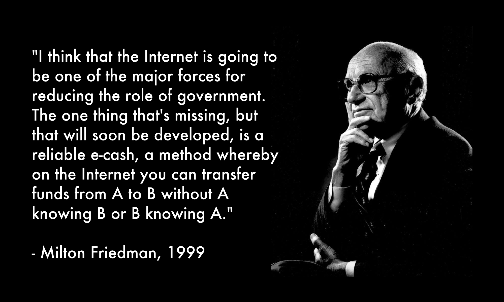
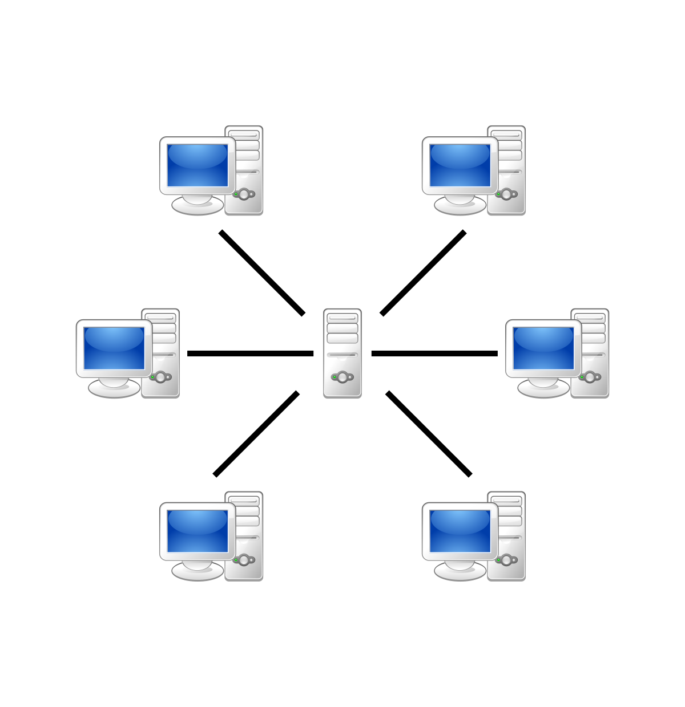
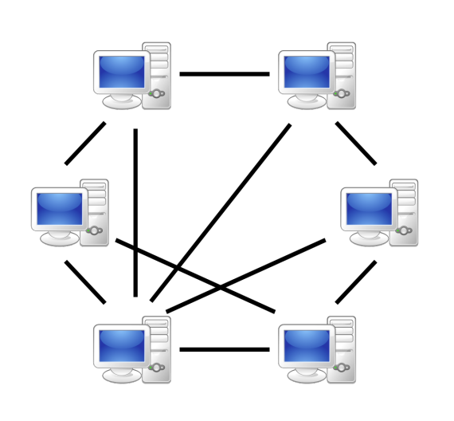

### Trzecia fala - wstęp do świata protokołów czyli kryptowalut

Jednym z chińskich przysłów jest „Obyś żył w ciekawych czasach” myślę, że to chińskie powiedzenie bardzo pasuje do procesu przemian rzeczywistości który niepostrzeżenie zmienia fundamentalne zasady funkcjonowania świata do jakiego przez wiele lat zostaliśmy przyzwyczajeni. Do napisania tego artykułu sprowokował mnie raport fundacji CFA który otrzymałem pocztą elektroniczną oraz informacja mówiąca o tym, że fundacja zamierza dodać do swojego egzaminu materiały dotyczące analizy biznesowej firm działających tylko w przestrzeni elektronicznej.  

W niniejszym artykule chciałbym przedstawić własną, przekrojową optykę na świat projektów cyfrowych (kryptowalut) a piszę przekrojową ponieważ to zagadnienie ma wiele warstw, natomiast ja zajmę się warstwą technologiczną oraz ekonomiczną (jest również wartwa społeczna, jednak o niej jedynie wspomnę) – myślę, że dyskusje o kryptowalutach bez wzięcia pod uwagę tych dwóch warstw jest jałową dyskusją dla osób którzy chcą zrozumieć i odpowiedzieć sobie na pytanie „o co chodzi w tych kryptowalutach”. Ze względu, że jak sam Gavin Wood (programista jednej z najważniejszych projektów jakim jest Ethereum) określił (i słusznie), że duża część społeczności zaangażowanej w kryptowaluty jest toksyczna oraz niemerytoryczna, panuje dużo szumu informacyjnego, zrobię co w mojej mocy, aby zawrzeć jak najwięcej linków źródłowych na podstawie której jest możliwość sprawdzenia przedstawionych hipotez (oraz bardziej wnikliwej analizy). Naturalnie zacznę od mojego prywatnego konika jakim jest historia.

Historia elektronicznego sposobu wymiany i transferu wartości (pieniądza) sięga około 1976 roku, kiedy zaczęły się poważniejsze prace w zakresie kryptografii, jednego z działu matematyki na której kryptowaluty bazują na fundamentalnym poziomie, to dzięki kryptografom dzisiaj w roku 2019 możemy usłyszeć na ulicy, że ktoś się zastanawia jak działa Bitcoin – najstarszy działający blockchain. Odnosząc się do historii kryptowalut oraz próby jej usystematyzowania myślę, że nie sposób jest wspomnieć o znanym amerykańskim ekonomiście Miltonie Friedmann który wprost przewidział pojawienie się elektronicznego sposobu wymiany oraz transferu wartości w sposób nieporównywalnie szybszy jaki znamy z tradycyjnej bankowości.

Powyżej zacytowane słowa Miltona Friedmanna poruszają dwa zagadnienia, pierwszym z nich jest manifest cyfrowych anarchistów (The Crypto Anarchist Manifesto) który został napisany przez ludzi którzy są związani z technologiami komputerowymi oraz kryptograficznymi gdzie jest opisywany scenariusz, mówiący o tym że technologia może zastąpić i/lub zredukować rolę rządów. Drugim zagadnieniem to „e-cash” czyli pieniądz elektroniczny który działa w architekturze peer – to – peer, już wyjaśniam o co chodzi. Obecne systemy informatyczne do których jesteśmy przyzwyczajeni działają w architekturze klient – serwer, pokazuję to poniżej:

Architektura systemów informatycznych ma liczne wady i zalety, jednak proszę zauważyć, że w momencie kiedy komputer oznaczony jako „Server” z losowych powodów przestanie działać każdy z klientów (komputery oznaczone „Client 1”, „Client 2”, „Client 3”) straci dostęp do usługi, praktyczny przykład to chociażby brak możliwości wypłacenia gotówki z bankomatu własnych pieniędzy w weekend z powodu „przerw technicznych” w banku, myślę, że większość ludzi zetknęło się z problemem braku możliwości wypłaty własnych pieniędzy z bankomatu. Jest to tzw. SPOF - „single point of failure”, który powoduje, że jedna usterka sprawia, że cały system przestaje działać. To co jest fascynującego i niezwykłego w technologii rozproszonych rejestrów (distributed ledger technology) jest to, że nie występuje problem SPOF, a jest to zrealizowane dzięki architekturze peer – to – peer:

Proszę zauważyć, że w tej architekturze każdy jest ze sobą równy i jeśli jeden z komputerów (fachowa nazwa to „węzeł”) przestanie działać automatycznie sieć przełączy się, na inny „peer” co powoduje, że ta architektura jest dużo bardziej odporna na wszelkiego rodzaju ataki, podstawowym założeniem tej sieci jest brak zaufania i każdy aktor w tej sieci weryfikuje każdego. Jednak jak każda technologia ma wady, należy wspomnieć o przypadku, kiedy większość – 51% komputerów zostanie zmieniony wykonywany kod źródłowy, wtedy mówimy o „ataku 51%” co w praktyce oznacza udany atak na sieć (zachęcam wnikliwych do poszczerzenia wiedzy w tym temacie).
Aż prosi się w tym miejscu wspomnieć o fascynującej książce Nassima Nicholas Taleba „Antykruchość” w której autor porównuje systemy kruche (łatwe do destrukcji) oraz systemy antykruche (trudne do destrukcji) i korzystając z tej analogii ewidentnie widać, że architektura nie mająca jednego miejsca który w przypadku awarii zatrzymuje funkcjonowanie całego systemu jest dużo bardziej antykruchy (peer-to-peer) niż kruchy system klient <=> serwer. Aby w pełni zrozumieć model peer – to – peer należy się zaznajomić z paroma terminami a pierwszym z nich jest „węzeł”.
Węzłem nazywamy każdy pojedynczy komputer z zainstalowanym odpowiednim oprogramowaniem, ze stałym podłączonym do sieci Internet dzięki której komputer ten na bieżąco aktualizuje aktualny stan łańcucha bloków:

W ten sposób przechodzimy do następnego kluczowego terminu jakim jest „blok” oraz „blockchain”. Blok jest to podstawowa składowa łańcucha bloków (blockchain) w którym są zawarte informacje o transakcjach jakie zostały wykonane w danej sieci, ze względu na limit długości tego artykułu pominę bardzo znaną ważną rolę tzw. konsensusu oraz problemy bizantyskich generałów, zapamiętajmy, że dzięki algorytmowi konsensusu jest ustalany kolejny blok w sieci.

W ten sposób przebrnęliśmy przez niezbędną teorią która powinna być zrozumiana, w praktyce jest to droga do fundamentalnej zmian paradygmatu życia w którym funkcjonujemy i do którego się przyzwyczailiśmy. Wyobraźmy sobie, że zamiast czekać na przelew od znajomego który musi przejść przez system bankowy możemy przesłać dowolną kwotę w dowolne miejsce w parę sekund za bardzo niską prowizję. Zastosowań technologii blockchain jest bardzo dużo, ale to co należy zapamiętać to to, że to pierwsza technologia której główną wartością dodaną to dostarczenie zaufania w środowisku gdzie tego zaufania nie ma. Wszelka certyfikacja wina, diamentów, działek, dzieł sztuki, obecnie jesteśmy w czasie kiedy firmy technologiczne zaczynają tokenizować wszelkie dobra którymi się otaczamy. Wyobraźmy sobie, że możemy handlować dziełem sztuki które jest przedstawione w postaci tokenu, cyfrowego odwzorowania który ten token jest nie do podrobienia a cała historia tego tokenu jest transparentna i publicznie dostępna.

Jak każda technologia ma wady i zalety, i chciałbym podkreślić jeden fakt, technologia blockchain to technologia gdzie każda aktywność jest dostępna publicznie, panuje zupełny brak anonimowości, wszystkie dane są publiczne. A to oznacza, że gdyby nastąpiła masowa adopcja technologii blockchain i każdy człowiek będzie mieć własny adres musimy być świadomi, że wszelkie wykonane przez nas zakupy pozostaną w naszej historii i tej historii nie ma możliwości zmienić. Myślę, że warto sobie ten fakt uświadomić.

Jako człowiek który ma doświadczenie w pracy w funduszach inwestycyjnych zrozumiałem, że jest możliwość tokenizacji wszelkich aktywów finansowych którymi handlują banki inwestycyjne, byłem bardzo ciekaw co zrobi fundacja CFA (znany certyfikat w świecie finansów) i uznałem, że jeśli mam rację CFA musi zacząć się dostosowywać czyli dodać do swoich certyfikatów analizę projektów kryptograficznych – i właśnie to się dzieje na moich oczach, CFA ogłosiło, że nastąpi aktualizacja egzaminów właśnie o tę tematykę która jest relatywnie świeża.

Osobiście uważam, że proces digitalizacji społeczeństwa - tytułowa trzecia fala już została rozpoczęta przez gigantów technologicznych a technologia blockchain odegra w tym procesie znaczącą rolę, jednak należy być świadomym wielu zagrożeń jak chociażby stopniowy zanik prywatności przy jednoznacznym coraz szybciej rozwijającemu się tzw. „surveillance capitalism” który bazuje na handlowaniu naszymi danymi które sami udostępniamy w sieci nie zdając sobie sprawy z tego jakie to ma długoterminowe negatywne konsekwencje dla nas.
Jakiś czas temu dowiedzieliśmy się, że Facebook zamierza wyemitować własną walutę którą nazwał Libra, na tę chwilę nie wiemy o tym przedsięwzięciu wiele, ale moim zdaniem to będzie analogiczny system który w Chinach działa już od lat w postaci aplikacji „WeChat”. Libra prawdopodobnie podobnie jak WeChat będzie działać w aplikacji którą każdy będzie mógł sobie zainstalować i normalnie płacić przechowywanymi tam środkami w sklepie, ci którzy byli w Chinach zapewne mieli możliwość zaobserwować, że znaczna część transakcji przeprowadzanych w Chinach odbywa się za pomocą kodu QR, myślę, że analogicznie będzie działać Libra od Facebooka. Jednak proszę mnie nie odebrać, że jestem zwolennikiem systemu WeChat czy Libra, już tłumaczę dlaczego. Kwestią krytyczną tego typu systemu to kto przechowywuje dane o transakcjach, w momencie masowej adopcji tych rozwiązań firmy będą wiedziały o każdej naszej transakcji co otwiera ogromne pole do nadużyć jak chociażby „personal scoring” - kupowane papierosy podwyższają ryzyko choroby a więc ubezpiecznie dla takiej osoby może być znacznie wyższe niż dla osoby niepalącej. To jedynie przykład jednej z wielu potencjalnych nadużyć, to czego możemy być pewni to te systemy będą niezwykle wygodne a wygoda ta będzie mieć na celu wykorzystanie jednej z podstawowych cech ludzi jakim jest lenistwo.
Drugą tezą jaką stawiam to to, że świat finansów w najbliższych latach zostanie zdigitalizowany, duża część aktywów finansowych zostanie przeniesiona na platformy elektroniczne oraz w niedalekiej przyszłości firmy w pełni cyfrowe nabiorą na znaczeniu – część instrumentów finansowych wyewoluuje do postaci tokenu oraz coraz to kolejne firmy technologiczne będą funkcjonować w zaprogramowanej tokenomice a płynący instytucjonalny kapitał przyspieszy rozwój cyfrowych firm. Tradycyjną ekonomię zastąpi ekonomia tokenu która zostanie zaprogramowana dzięki programiście za pomocą kodu źródłowego rozumianego przez komputer oraz programistę i pierwsi zarządzający w funduszach którzy znajdą wartościowe projekty oraz protokoły potencjalnie mogą zdobyć ogromną przewagę która może utrwalić się na długie lata – cyfrowe firmy w dużej mierze to transgraniczne instytucje działające globalnie, nie znające oraz nie uznające granic państw.

Nie spodziewam się, że zmiany nastąpią z dnia na dzień, ale uważam, że proces dygitalizacji z jednej strony będzie ceteris paribis rynków finansowych jakie znamy, ale z drugiej strony  za parę lat systemy ekonomiczne będą opierać się tokenomice (zaprogramowanych regułach insentywizacji kolejnych użytkowników, jak również mniej opłacalnych strategii funkcjonownania w danym systemie) a wyżej opisaną tezę opieram na wielu rozmowach, obserwacjach działań firm technologicznych oraz codziennej obserwacji otoczenia w którym lokalnie żyję i funkcjonuję.

### Linki

* <https://pl.wikipedia.org/wiki/Trzecia_Fala>

* <https://hackernoon.com/token-economics-1-why-do-we-need-token-economics-2c0006098aea>

* <https://www.bloomberg.com/news/articles/2018-07-16/cfa-exam-adds-crypto-blockchain-topics-as-wall-street-dives-in>

* <https://medium.com/@teamwarren/the-coming-economic-crash-and-how-to-stop-it-355703da148b>

* <https://github.com/thirdwave-network/thirdwave-network-website/blob/master/src/content/documents/Investment-Professional-of-the-Future-FoF_Rev.pdf>

* <https://www.meetup.com/Silesia-Blockchain-Meetup/>

* The Age of Surveillance Capitalism: The Fight for a Human Future at the New Frontier of Power
